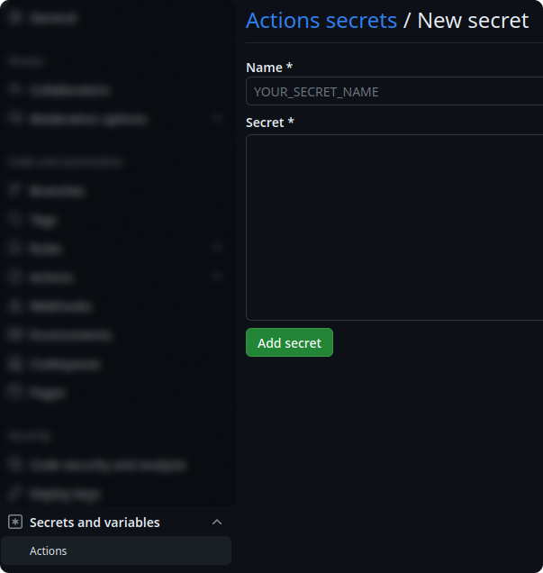

# zenn-qiita-sync
<p align="left">
   
   <a href="https://opensource.org/licenses/MIT"></a>
   <a href="./README.md"></a>
   <a href="./README.ja.md"></a>
   
</p>

zenn 用の記事を GitHub にプッシュすると、自動的に qiita に記事を公開するためのツールです。記事を複数のプラットフォームに公開することで、より多くの人と知識を共有できます。

<details>
    <summary>&thinsp;&thinsp;<b>目次</b> (クリックすると開きます)</summary>

- [🚀 使い方](#-使い方)
- [🙋‍♂️ お願い](#️-お願い)
- [✉️ お問い合わせ](#️-お問い合わせ)
- [🙏 謝辞](#-謝辞)
</details>

## 🚀 使い方
このツールを使用するには、以下の手順に従ってください。
1. 以下のようなディレクトリ構造を準備します。
    ```
    .
    ├── articles   ... Zenn形式の記事
    ├── books      ... Zenn形式の本 (任意)
    ├── images     ... 記事で使用する画像ファイル
    └── qiita
        └── public ... Qiita形式の記事
    ```
2. `qiita-cli` を使用して Qiita アクセストークンを発行します。
    - 詳しくは[公式リポジトリ](https://github.com/increments/qiita-cli/tree/v1)をご覧ください
3. 発行したトークンをシークレット変数として設定します。
    - `https://github.com/<USERNAME>/<REPO>/settings/secrets/actions/new` に移動すれば設定できます（`<USERNAME>` と `<REPO>` はそれぞれ自分の情報に置き換えてください）。
    - `QIITA_TOKEN = <Your Qiita Access Token>` の形式で設定してください。

        <p align="center">
        
        </p>

4. 自分のリポジトリ内の `.github/workflows` に新しいワークフロー（例: `publish.yml`）を作成します。

    <b>実装例</b>（以下をコピーして貼り付けてください）

    ```yml
    name: Publish articles

    on:
      push:
        branches:
          - main
          - master
        workflow_dispatch:

    permissions:
      contents: write

    concurrency:
      group: ${{ github.workflow }}-${{ github.ref }}
      cancel-in-progress: false

    jobs:
      publish_articles:
        runs-on: ubuntu-latest
        timeout-minutes: 5
        steps:
          - name: Checkout
            uses: actions/checkout@v4
            with:
              fetch-depth: 0

          - name: Run
            uses: C-Naoki/zenn-qiita-sync@main
            with:
              qiita-token: ${{ secrets.QIITA_TOKEN }}
    ```
    実際にこのツールを使用している例は[こちら](https://github.com/C-Naoki/zenn-archive/tree/main)を参照してください。

## 🙋‍♂️ お願い
💙 このツールを気に入っていただけたら、⭐ をつけて、友達にもシェアしてください！

## ✉️ お問い合わせ
質問や提案がある場合は、お気軽に [issue](https://github.com/C-Naoki/zenn-qiita-sync/issues) を投稿してください。フィードバックをいただけると嬉しいです！ご連絡をお待ちしております！

## 🙏 謝辞
有益な情報や価値あるコードを提供してくださった以下の記事やオープンソースに感謝申し上げます。

- [zennに記事を投稿したらqiitaにも同時に投稿されるツールを作った話](https://qiita.com/shunk_jr/items/7d1029cae8f83ee8fd84)
- [Zenn / Qiitaに投稿する同じ記事を一元管理するGitHubリポジトリを作りました](https://zenn.dev/ot07/articles/zenn-qiita-article-centralized)
- https://github.com/increments/qiita-cli
