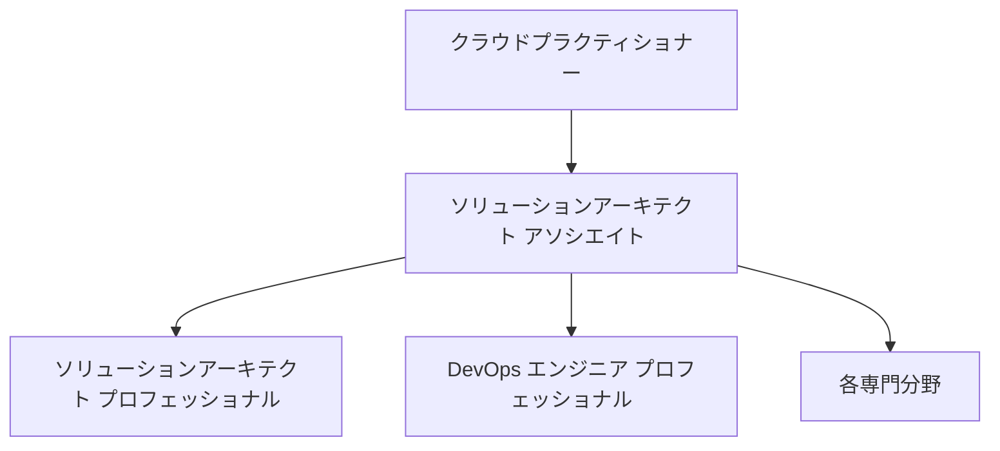
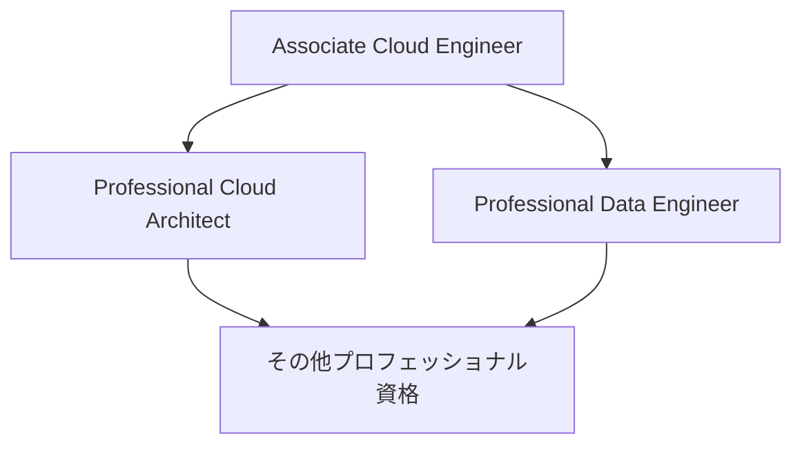
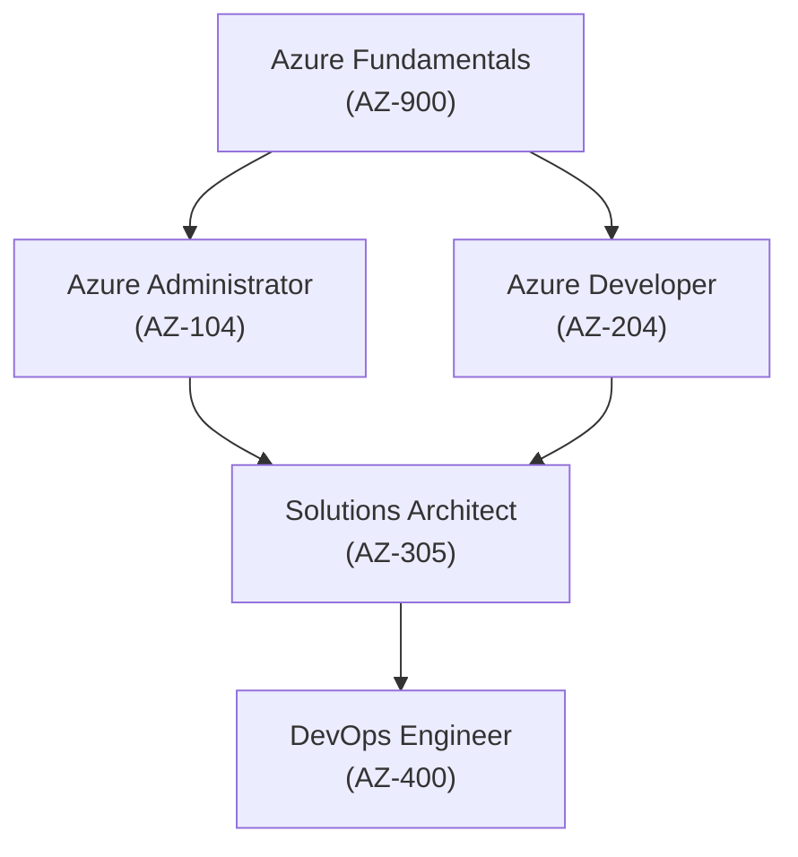

# 【時間が限られているなら】応用情報よりクラウド資格を選ぶべき理由【AWS・GCP・Azure】

## ✅ はじめに：日本でよく聞く「定番資格」は本当に今でも最適解？

エンジニアとしてスキル証明やキャリアアップを考えるとき、次のような資格が候補に挙がることが多いでしょう。

- 応用情報技術者試験（AP）
- システムアーキテクト試験（SA）
- ITストラテジスト試験（ST）
- プロジェクトマネージャ試験（PM）
- エンベデッドシステムスペシャリスト試験（ES）
- Oracle認定資格（Bronze/Gold等）

これらは**歴史ある権威ある試験**ですが、**取得にかかる時間が長い・専門特化で汎用性が低い・実務で活かす場が少ない**という落とし穴もあります。

---

## 新卒1年目でAWS全冠する人がゴロゴロいる日鉄ソリューションズ株式会社

https://qiita.com/eureka_/items/a1f29278c687a9183a07

https://qiita.com/rindo_/items/6280ffe663fab8bceef8

## 💡 これからの時代に必要なのは「即戦力のクラウドスキル」

クラウドが当たり前の今、「**インフラは触れなくて当たり前 → 設計・構築できて差がつく**」時代になっています。  
特に次の3つは世界・日本ともに採用市場で非常に注目されています。

- 🌐 **AWS（Amazon Web Services）**
- ☁️ **GCP（Google Cloud Platform）**
- 🔵 **Azure（Microsoft Azure）**

---

## 📊 各資格の比較マトリクス

| 資格 | 難易度 | 汎用性 | 市場ニーズ | 資格人口 | コメント |
|------|--------|--------|-------------|----------|----------|
| 応用情報 | 中 | 中 | 高 | 多い | 基礎知識の証明には有効 |
| システムアーキテクト | 高 | 低〜中 | 中 | 少ない | 設計志望に◎だが活かしにくい |
| ITストラテジスト | 高 | 低 | 中 | 極少 | IT企画層向けで実務には直結しにくい |
| プロマネ（PM） | 高 | 中 | 高 | 多い | 大手志向には◎ |
| エンベデッドSS | 高 | 低 | 特定領域のみ | 極少 | 組み込み業界限定の希少資格 |
| Oracle認定 | 中 | 中 | 中 | 多い | データベース限定で活躍 |
| **AWS SAA** | 中 | **高** | **非常に高い** | **希少** | 転職・実務・副業でも即効性あり |
| **GCP ACE** | 中 | **高** | **増加中** | **希少** | まだまだ少数派＝差別化できる |
| **Azure AZ-104** | 中 | **高** | **高（Microsoft系）** | **希少** | 業務直結しやすく成長中 |

---

## 🔍 資格取得に必要な学習時間の違い（目安）

| 資格 | 学習時間 | 実務との連動 | 試験頻度 | 特記事項 |
|------|----------|---------------|----------|----------|
| 応用情報 | 150〜250時間 | △ | 春秋のみ | 学科のみ、理論中心 |
| システムアーキテクト | 250〜400時間 | △ | 春秋のみ | 記述あり、高難易度 |
| AWS SAA | 50〜80時間 | ◎ | いつでも受験可 | 学習効率が高く、案件に直結 |
| GCP ACE | 60〜90時間 | ◎ | 常時受験可能 | Qwiklabsなど実技練習豊富 |
| Azure AZ-900〜104 | 30〜90時間 | ◎ | 随時 | Microsoft Learnが充実 |

---

## 📈 いま取得すべきは「クラウド資格」である理由

### ✅ 1. **採用市場が明確にクラウド人材を求めている**

- AWS/GCP/Azureは求人検索で**爆発的にヒット**
- 一方、IPA資格はスクリーニング要素にとどまる場合が多い

### ✅ 2. **即戦力スキルとして案件に繋がる**

- クラウド構築・移行・IaC・DevOps案件は**資格者優遇**
- 特に副業やSESで**単価が上がる**

### ✅ 3. **資格保有者がまだ少ない（希少性が高い）**

- 応用情報：毎年**6万人以上**合格
- AWS SAA：**日本語受験者まだ限られる**
- GCPやAzureは**さらに少数＝ブルーオーシャン**

---

## ✍️ ここまでのまとめ

- 「応用情報」や「アーキテクト」は評価されやすいが、**実務での即効性・汎用性ではクラウド資格に軍配**
- 限られた時間を「投資」するなら、**AWS・GCP・Azure**は「成長中×希少スキル×高単価」の3拍子が揃った超コスパ資格！

📌 **OpenAI公式資格がでてくるまではGAFAM母体のクラウド資格。**

# 🌐 AWS・GCP・Azureのクラウド資格はどれを受けるべき？【徹底比較】

## 🎯 比較ポイント
- 難易度
- 市場での差別化
- 報酬（期待される年収）

---

## ✅ クラウド資格比較マトリクス

| 資格名 | 難易度（★1〜5） | 市場での差別化 | 想定される報酬傾向 | コメント |
|--------|------------------|----------------|---------------------|----------|
| **AWS クラウドプラクティショナー (CLF-C02)** | ★☆☆☆☆ | 低 | 400〜550万円 | 初心者に最適なスタート資格 |
| **AWS ソリューションアーキテクト アソシエイト (SAA-C03)** | ★★☆☆☆ | 中 | 550〜700万円 | AWSの中核資格。実務でも強い |
| **GCP Associate Cloud Engineer (ACE)** | ★★☆☆☆ | 中 | 500〜650万円 | GCP資格で入りやすい |
| **GCP Professional Cloud Architect** | ★★★☆☆ | 高 | 700〜900万円 | 高難易度＋高報酬の最強資格 |
| **Azure Fundamentals (AZ-900)** | ★☆☆☆☆ | 低 | 400〜550万円 | Microsoft系企業向けに◎ |
| **Azure Administrator (AZ-104)** | ★★☆☆☆ | 中 | 550〜700万円 | 現場と連携しやすい実務資格 |
| **Azure Solutions Architect (AZ-305)** | ★★★★☆ | 高 | 700〜900万円 | 少数精鋭のアーキ資格 |

---

## 🧭 状況別おすすめ資格

| あなたの立場 | おすすめ資格 | 理由 |
|---------------|----------------|------|
| クラウド初心者・未経験 | AWS CLF-C02 or AZ-900 | 基礎から学べて短期合格可能 |
| 転職・キャリアアップ | AWS SAA-C03 or GCP ACE | 実務即戦力＋転職市場で人気 |
| GCP志望 or データ系 | GCP Professional Cloud Architect | 希少価値が高く、高報酬 |
| Microsoft系企業 | AZ-104 or AZ-305 | 業務との親和性◎ |
| 副業・フリーランス志望 | AWS SAA-C03 + GCP ACE | 案件幅が広がる鉄板コンボ |

---

## 💬 ここまでのまとめ

- ✅ **AWS SAA-C03**：案件に即効性あり
- ✅ **GCP Professional Cloud Architect**：希少性×報酬の最強バランス
- ✅ **AZ-305**：Microsoft系でアーキを目指すなら必須

初心者なら、まずはCLF-C02（AWS）かAZ-900（Azure）から始めて、徐々にレベルアップしていきましょう！

# 🟧 AWS資格取得ロードマップ

## ✅ AWS認定資格一覧

| レベル | 資格名 | 略称 | 難易度 |
|-------|--------|------|--------|
| 初級 | クラウドプラクティショナー | CLF-C02 | ★☆☆☆☆ |
| 中級 | ソリューションアーキテクト アソシエイト | SAA-C03 | ★★☆☆☆ |
| 中級 | デベロッパー アソシエイト | DVA-C02 | ★★☆☆☆ |
| 中級 | SysOps アドミニストレーター アソシエイト | SOA-C02 | ★★☆☆☆ |
| 上級 | ソリューションアーキテクト プロフェッショナル | SAP-C02 | ★★★★☆ |
| 上級 | DevOps エンジニア プロフェッショナル | DOP-C02 | ★★★★☆ |
| 専門 | セキュリティ – 専門知識 | SCS-C02 | ★★★☆☆ |
| 専門 | 機械学習 – 専門知識 | MLS-C01 | ★★★☆☆ |
| 専門 | 高度なネットワーキング – 専門知識 | ANS-C01 | ★★★★☆ |
| 専門 | データベース – 専門知識 | DBS-C01 | ★★★☆☆ |
| 専門 | SAP on AWS – 専門知識 | PAS-C01 | ★★★☆☆ |

## 🔁 AWS資格ロードマップの進め方

---

## 📘 最も簡単なAWS資格の学習法：クラウドプラクティショナー（CLF-C02）

参考記事: [Zenn - AWSクラウドプラクティショナー合格法](https://zenn.dev/apo_zenn/articles/85ff122fc6eae2)

### 学習ステップ

1. **Udemy講座受講**（おすすめ講座は調査中だが★が高いものと、更新が最新のものが良いと思います）
2. **AWS公式無料トレーニング**（[AWS Skill Builder](https://skillbuilder.aws/)）
3. **模擬試験で練習**（1周目は答えを見ても良い）
4. **間違えたところを参考書で復習**
4. **模擬試験で練習**（2周目も答えを見ても良い）
4. **間違えたところを参考書で復習**
4. **模擬試験で練習**（3周目も答えを見ても良い）
4. **問題を見たら答えが出るぐらいに覚えても良いそして参考書とのエンドレス**
5. **試験申し込み**

---

# 🟦 GCP資格取得ロードマップ

## ✅ GCP認定資格一覧

| レベル | 資格名 | 難易度 |
|--------|--------|--------|
| 初級 | Associate Cloud Engineer (ACE) | ★★☆☆☆ |
| 中級 | Professional Cloud Architect | ★★★☆☆ |
| 中級 | Professional Data Engineer | ★★★☆☆ |
| 上級 | その他プロフェッショナル資格（Security, DevOps, ML 等） | ★★★★☆ |

## 🔁 GCP資格ロードマップの進め方

---

## 📘 最も簡単なGCP資格の学習法：Associate Cloud Engineer (ACE)

### 学習ステップ

1. **Courseraの「Google Cloud Fundamentals」受講**
2. **Qwiklabs（ハンズオンラボ）で実践**
3. **Udemy模擬試験で慣れる**
3. **模擬試験で練習**（1周目は答えを見ても良い）
4. **間違えたところを参考書で復習**
4. **模擬試験で練習**（2周目も答えを見ても良い）
4. **間違えたところを参考書で復習**
4. **模擬試験で練習**（3周目も答えを見ても良い）
4. **問題を見たら答えが出るぐらいに覚えても良いそして参考書とのエンドレス**
4. **Google公式のドキュメントを読む**
5. **試験本番へ挑戦！**

---

# 🟩 Azure資格取得ロードマップ

## ✅ Azure認定資格一覧

| レベル | 資格名 | 略称 | 難易度 |
|--------|--------|------|--------|
| 初級 | Azure Fundamentals | AZ-900 | ★☆☆☆☆ |
| 中級 | Azure Administrator Associate | AZ-104 | ★★☆☆☆ |
| 中級 | Azure Developer Associate | AZ-204 | ★★☆☆☆ |
| 上級 | Azure Solutions Architect Expert | AZ-305 | ★★★★☆ |
| 上級 | DevOps Engineer Expert | AZ-400 | ★★★★☆ |
| 専門 | Security Engineer, AI Engineer, Data Engineer 他 | AZ-500 他 | ★★★☆☆～★★★★☆ |

## 🔁 Azure資格ロードマップの進め方

---

## 📘 最も簡単なAzure資格の学習法：Azure Fundamentals (AZ-900)

### 学習ステップ

1. **Microsoft Learnの無料教材を活用（超充実）**
   - [AZ-900学習パス](https://learn.microsoft.com/ja-jp/training/paths/azure-fundamentals/)
2. **YouTubeの日本語解説動画で理解を深める**
3. **模擬試験で練習**（1周目は答えを見ても良い）
4. **間違えたところを参考書で復習**
4. **模擬試験で練習**（2周目も答えを見ても良い）
4. **間違えたところを参考書で復習**
4. **模擬試験で練習**（3周目も答えを見ても良い）
4. **問題を見たら答えが出るぐらいに覚えても良いそして参考書とのエンドレス**
4. **無料 or 割引クーポンで試験申し込み**

---

# ✅ ここまでｎまとめ

| クラウド | 最も簡単な資格 | 学習期間の目安 | ポイント |
|--------|------------------|----------------|---------|
| AWS | クラウドプラクティショナー（CLF-C02） | 1〜2週間 | Udemy + Skill Builder |
| GCP | Associate Cloud Engineer（ACE） | 2〜3週間 | Coursera + Qwiklabs |
| Azure | Azure Fundamentals（AZ-900） | 1週間前後 | Microsoft Learnが神 |

---

