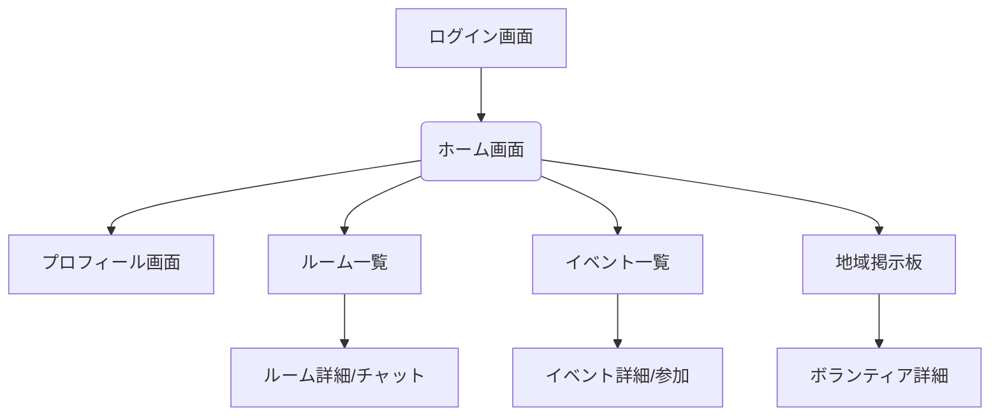

# 👨‍💻エンジニアの父が高校生の君に本気で伝えたい「資格と開発」のリアル
〜資格を超える力を、君たちが身につけるために〜

## 🎯 はじめに：その「資格、取るべき？」という問いに本気で向き合う

「父さん、やっぱり資格って取ったほうがいいの？」

こんな質問を君から受けたとき、正直に言うと「うれしかった」。
君が、自分の将来やキャリアについて真剣に考えていることが伝わってきたからだ。

だけど、父として、そして20年以上この業界で働いてきた一人のエンジニアとして、
この質問には単純な「YES」も「NO」も答えられない。
だから、この記事を通じて本気で答えたい。

---

## 💡 なぜ今、資格だけではダメなのか？

### 📚 IPA国家資格を「取るに越したことはない」理由

まず最初に大前提。

資格を取ること自体は、まったく悪くない。むしろ、良いこと。

国家資格（基本情報・応用情報・ネットワークスペシャリストなど）は、IT業界の基礎教養の一つとしての価値は今もある。

#### 国家資格のメリット
- ✔️ IT基礎知識が体系的に学べる  
- ✔️ 試験勉強によって「読む力・書く力・考える力」が身につく  
- ✔️ 一部の企業では昇進・昇格の条件になることもある  

---

### ⚠️ でも「持ってる人が増えすぎた」という事実

「資格を取れば武器になる」と信じて頑張っても、それを持つ人が何万人もいたら、果たして“武器”と呼べるだろうか？

例えば、基本情報技術者試験の合格者数は、これまでに150万人以上。  
応用情報でも50万人以上。

📉 つまり、「持っていて当たり前」の資格になりつつある。  
その結果、こんな現実が生まれている。

| 資格取得者の現実 | 内容 |
|------------------|------|
| 📉 差別化にならない | 「え、まだ持ってなかったの？」とすら言われる |
| 🧱 実務で活かせない | 暗記中心で、現場で使えるスキルはほぼない |
| 🧓 競合が強すぎる | 社会人10年選手や東大生も保有している |

---

## ⚔️ 君たち若者が「資格持ちの年配」に勝つたった一つの方法

**結論から言おう。「新しいサービスを作って、世の中に出す」**  
これだけが、君たちが年配の優秀な資格持ちに“実際に勝てる”方法だ。

### 🎮 例：高校生がゲーム制作→SNSで拡散→就職へ

たとえば、ある高校生がUnityで小さなゲームを作って、Twitterで公開した。  
その動画はXで2万回再生され、GitHubには200スターがついた。

彼は、実務経験ゼロ。資格もなし。  
でも、企業から直接DMが届いた。

「一緒に作りませんか？」と。

---

## 🧠 なぜ、サービスを作るだけで勝てるのか？

Webサービスやアプリ開発とは、自分で市場を生み出せる力。  
資格とは「レールの上を走る力」。  
開発は「レールそのものを作る力」。

| 比較 | 資格 | 開発 |
|------|------|------|
| 🎯 ゴール | 合格点 | ユーザー満足 |
| 📏 成果物 | ペーパー | 実際のプロダクト |
| 📈 競争相手 | 多数 | ほとんどいない（特に学生なら） |

---

## ☁️ それでも資格を取るなら「AWS資格」が最適解

もし、どうしても資格を取りたいなら、AWS資格をおすすめする。

### なぜAWS？
- 🌐 クラウドはこれからの時代のインフラ
- 🧠 実務に直結する知識が多い
- 👀 学生で持っていると企業から「え！？」と驚かれる

特に「Cloud Practitioner → Solutions Architect」まで行くと超目立つ。

---

## 👨‍🏫 父が作ったAWS学習ロードマップはこちら  
👉 [AWS学習ロードマップ（Qiita）](https://qiita.com/nakamoto/items/0588e74e60bab6a9f2f3)

📌 学生時代にAWSの資格合格してる人、実は結構いる。  
それくらい難関ではない。だけど、目立つ。

---

## 🕒 学生時代は「時間」そのものが資産

「3年後に何か作る」じゃ遅い。**今しかない。**

大学や社会に出ると、時間は一気に“奪われる”。  
テスト、課題、バイト、付き合い、就活…。

それに比べて、高校生の今は「自分の時間をコントロールできる唯一の時期」。

だから、言いたい。  
**今のうちに「試合経験」を積み、とにかく出場してほしい。出場すれば負けるかもしれないけど、勝てるかもしれない。つまり、出場しないと勝てないし、負けても失うものは何もないし、得られるものしかない**

---

## 🎮 どの試合に出るか？（具体的なアプリ例）

以下に、高校生でも挑戦できるアプリの具体例を紹介します。

| アプリカテゴリ | アプリ名の例 | アイデア・目的 |
|----------------|---------------|----------------|
| 💬 日記SNS系 | SoloLog | 「ひとり用SNS」。誰にも見られない“自分だけの日記”を投稿してログを残せる。 |
| ⏰ 時間管理系 | StudyTimer Pro | ポモドーロ勉強法＋SNS機能で「誰かと一緒に勉強している感覚」が味わえるタイマーアプリ。 |
| 🧘‍♂️ メンタル系 | MindDrop | 悩みを書いてボタンで水に流すアニメーション付き。AIがさりげない励ましをくれる。 |
| 📚 教育系 | 教えてGPT先生！ | 高校生向けにChatGPT APIを使って、英語・数学の質問に即時回答するQ&Aアプリ。 |
| 📍 地域密着系 | 学校周辺グルメMAP | 学校周辺の飲食店をレビュー＆ランク付け。生徒同士で投稿。Googleマップと連携。 |
| ✍️ 勉強ノート共有 | OpenNote | 自分のノートを画像でアップ＆共有し、他人のノートにも「いいね」できる機能。学生版Notion的。 |

---

# 🏠 Flutterで作る「寮内コミュニケーションアプリ」設計書
〜寮内・地域とつながる、世代を超えた交流プラットフォーム〜

---

## 🎯 アプリの目的

| 課題                 | 解決する内容                                   |
| -------------------- | ---------------------------------------------- |
| 学年間で交流がない     | 学年を超えて寮生同士が自然につながれる仕組み         |
| 土日に孤立しがち       | 自発的な週末イベントや集まりを生み出す機能           |
| 地域との接点がない     | 地域住民とのコミュニティ形成のきっかけを提供         |

---

## 🧱 アプリ概要

- 名前案：**Connect**
- 使用技術：Flutter + Firebase（認証、Firestore、Storage）
- 対象：高校生・大学生の寮生、地域住民（ゲスト参加）

---

## 📱 主要機能一覧

| カテゴリ       | 機能名               | 内容                                           |
| -------------- | ------------------ | ---------------------------------------------- |
| 👤 ユーザー管理   | プロフィール作成     | 学年、趣味、所属を登録                               |
| 🧑‍🤝‍🧑 学内交流   | 「テーマ別ルーム」参加 | 趣味や話題ごとに部屋を作成・参加                             |
| 📅 週末活動     | 「今週の集まり」掲示板 | 自発的な活動を提案・参加者募集                               |
| 🏡 地域交流     | 「地域ボランティア」掲示板 | 地域からの募集に応募、または提案                               |
| 🔔 通知         | FCMでリアルタイム通知 | 新イベント・メッセージを通知                                 |
| 💬 チャット     | 各ルーム内チャット   | 部屋・イベントごとのチャット機能                               |

---

## 🎓 Flutter学習ロードマップ（寮内SNSアプリ向け）

| ステップ | 内容             | 学習ポイント                                   | 目安時間   |
| -------- | ---------------- | ---------------------------------------------- | -------- |
| Step 1   | 環境構築         | Flutter SDK + VS Code + Android Studio           | 半日     |
| Step 2   | Dart文法         | 変数・条件分岐・関数                               | 2日      |
| Step 3   | ウィジェット入門   | Scaffold, Text, Row, ListView など               | 3日      |
| Step 4   | UI実装           | プロフィール画面、掲示板一覧など                       | 3〜5日   |
| Step 5   | 状態管理         | `setState`, Provider, Riverpod                   | 1週間    |
| Step 6   | Firebase認証     | Googleログイン / 匿名ログイン                        | 2日      |
| Step 7   | Firestore連携    | ユーザー・ルーム・メッセージ保存                       | 1週間    |
| Step 8   | アプリ公開       | Google Play 審査申請                             | 2〜3日   |

---

## 🗃️ Firestoreデータベース構成（例）

```
/users/{uid}
  - name: "山田太郎"
  - grade: 2
  - interests: ["音楽", "筋トレ"]
  - joinedRooms: [roomId1, roomId2]

/rooms/{roomId}
  - title: "筋トレ部屋"
  - tags: ["筋トレ", "健康"]
  - createdBy: uid123
  - members: [uid123, uid456]

/events/{eventId}
  - title: "日曜の朝ランニング"
  - description: "朝7時に集合！"
  - host: uid789
  - participants: [uid789, uid222]

/messages/{roomId}/{messageId}
  - senderId: uid123
  - content: "おはよう！"
  - timestamp: 2025-05-03T09:30:00

```

---
## 🔄 画面遷移フロー図（Mermaid）


---

## 🧩 画面構成とウィジェット例

| 画面名         | 使用ウィジェット                       |
| -------------- | -------------------------------------- |
| ホーム画面     | `Scaffold`, `BottomNavigationBar`      |
| ルーム一覧     | `ListView`, `Card`, `Chip`             |
| チャット画面   | `StreamBuilder`, `TextField`, `ListTile` |
| イベント詳細   | `Column`, `ElevatedButton`, `Container`  |
| 地域掲示板     | `ListView.builder`, `ExpansionTile`    |

---
## 👣 他の人と違う道を選ぶ、それが勝ち筋

「資格＝安全な道」ではない  
資格を取るという選択は、「他人が決めたルールの中で戦う」ことを意味する。  
そのルールが「試験」というゲームだとしたら、得意な人が必ず勝つ。

でも、開発なら？

**君がゲームのルールそのものを作ってしまえばいい。**

---

## 🚀 最後に父からのメッセージ

君の未来は、資格で決まらない。  
でも、行動で決まる。

資格に時間を使うより、  
コードを書いて、プロダクトを作って、公開してほしい。

- バズらなくてもいい  
- 誰も使わなくてもいい  
- でも「試合に出る経験」が、すべてを変える  
- 最終的には資格を作る側に立てば、この意味がわかる
- そして、なんでも相談してほしい


## [PR]起業・転職・フリーランス・プログラミング研修・エンジニア採用コンサルティングのご相談
https://park.jp/service_menu/2491
- 60分の人生相談を行っております。
- 企業の方は初回限定割引はご利用できません。
- 企業向けDXコンサルティングは年間契約でお受けしております。
